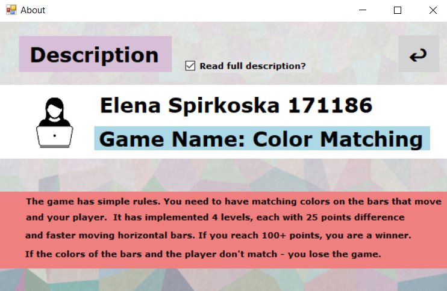
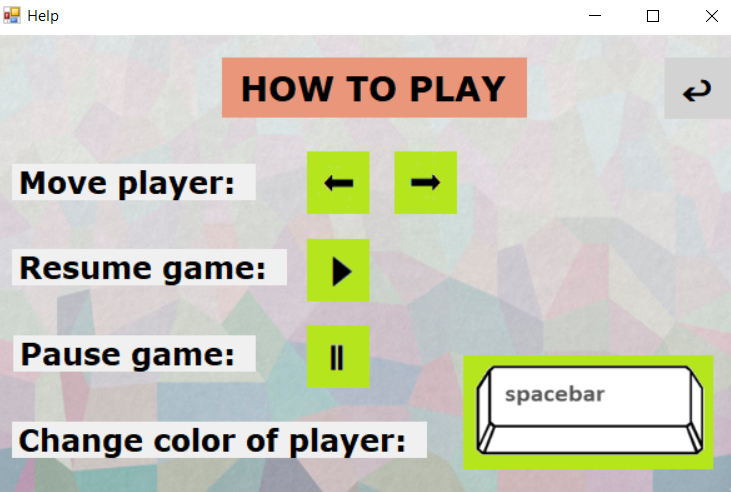
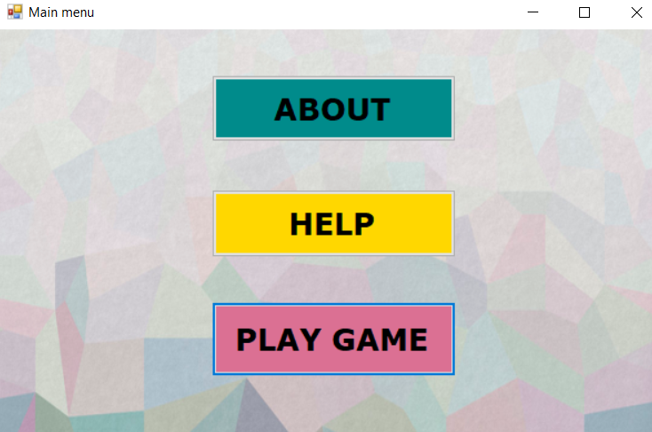
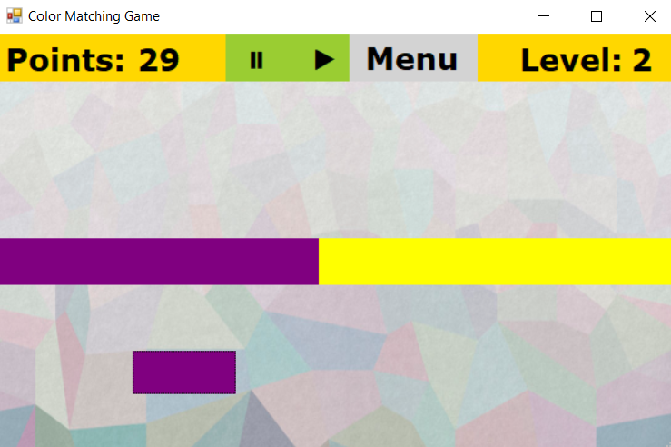
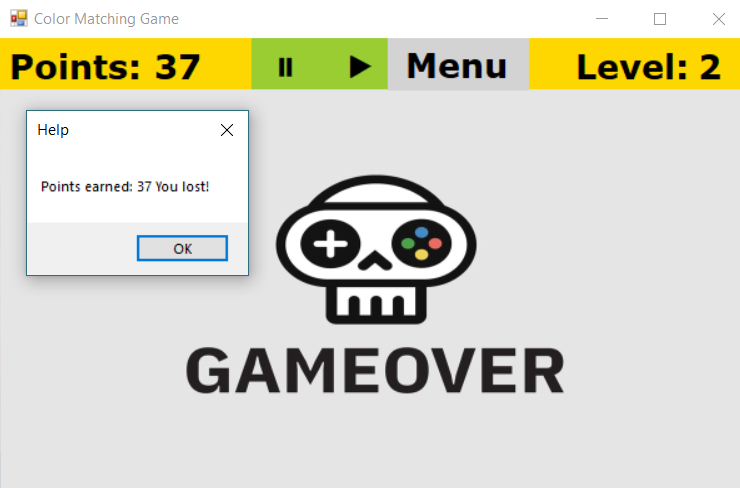

# Color Matching 
Проектна задача по предметот Визуелно програмирање © ФИНКИ 2020

## 1. Опис - Windows Forms Application "Color Matching"
 
Апликацијата која што ја изработив е игра именувана "Color Matching".
Самото име интуитивно објаснува дел од главната тематика на истата. Корисникот собира поени доколку бојата на хоризонталните блокови кои рандом 
менуваат бои е иста со неговата. Играта има 4 нивоа кои носат максимално 100 поени (секое ниво се разликува за 25 поени). 
За секое ниво брзината на движење на блоковите е побрза од претходното. Доколку се добијат 100+ поени - корисникот победил. Ако играчот и 
хоризонталниот блок имаат различна боја играта е завршена - корисникот губи, со опција да виде колку поени освоил и почне нова игра.

## 2. Упатство за употреба

## 2.1 Главно мени
При старт на апликацијата се појавува мени со релативно едноставен дизајн кое нуди избор за корисникот:

- About
- Help 
- Play Game

При клик на некоја опција се пренасочуваме кон конкретната форма за [about, help, game]. 

## 2.2 About 

Го содржи описот и правилата на игра. Овозможен е поглед само на името на играта и од кого е изработена, како и опција да се види подетална
документација за истата, во зависност од желбите на корисникот. Има можност за враќање на главното мени.

## 2.3 Help 

Овозможува сликовит приказ како се игра играта. Се користат left arrow key, right arrow key, space од тастатура како и клик на 
соодветно дефинираните копчиња. Има можност за враќање на главното мени.

## 2.4 Play Game 

Главен дел - the actual game.
Доколку корисникот успее да оди од ниво на ниво, цело време има увид на бројот на поени и нивото на кое се наоѓа, како и опции за пауза и старт  на 
веќе паузираната игра. Доколку собери 101 поен победува и е информиран со соодветна порака дека победил + sound effect кој асоцира на победа. 
Доколку изгуби, се појавува соодветна порака со информација за бројот на освоени поени.
Придружено со "losing" звук за да се постигне подобар ефект.

## 3. Податочни структури и компоненти 

Апликацијата е составена од 4 класи кои наследуваат од Form [menu, about, help, game](форми) и овозможуваат навигација низ истата.
Додадена е исто така една custom made компонента customPictureBox која наследува од PictureBox. Додавањето е направено за да се овозможи 
таа да биде selectablе и тука се дефинира што се случува со играчот при притискање на left, right arrow key и space соодветно.
Боите се зададени во низа Color [] colors. Хоризонталните блокови имаат една боја повеќе (4) од оние дефинирани за играчот
(3) за да може да се изгуби играта :)

Во прилог е опис на дел од функциите кои се имплементирани и логиката на секоја форма. 

## CustomPicturebox.cs

changeColor()
- Овозможува промена на бојата на играчот.

OnPreviewKeyDown()
- Имплементирани се движењата по х оската при користење на left & right arrow keys + space.

## аbout.cs

labels()  
- Овозможува лабелите дефинирани во дизајн делот да не се прикажуваат.

lblMenu_Click()  
- Ја затвора тековната форма и  го прикажува главното мени.

checkFull_CheckedChanged()  
- Овозможува приказ или криење на лабелите во зависност од изборот на корисникот (checkbox).

## help.cs

lblMenu_Click()  
- Ја затвора тековната форма и го прикажува главното мени.

## menu.cs

- При клик на секое копче се затвора тековната форма и се отвора соодветната.

## game.cs

Содржи најголем дел од логиката на играта. 

move()  
- Ги поместува хоризонталните блокови со различна брзина во зависност од нивото на кое е играчот [најспоро на 1 ново, најбрзо на 4 ниво].
Доколку ја надминат висината на прозорецот, се доделува рандом боја на секој блок за наредното движење.

gameover()  
- Проверува дали дошло до допир или "пресек" на играчот и хоризонталниот блок. Доколку се иста боја, играчот собира
поени и продолжува со играта. Нивоата се дефинирани како: 
- Ниво 1: 00 - 25 
- Ниво 2: 26 - 50 
- Ниво 3: 51 - 75 
- Ниво 4: 75 - 100

При победа или пораз се прикажуваат соодветни пораки, слики и sound effects. 
